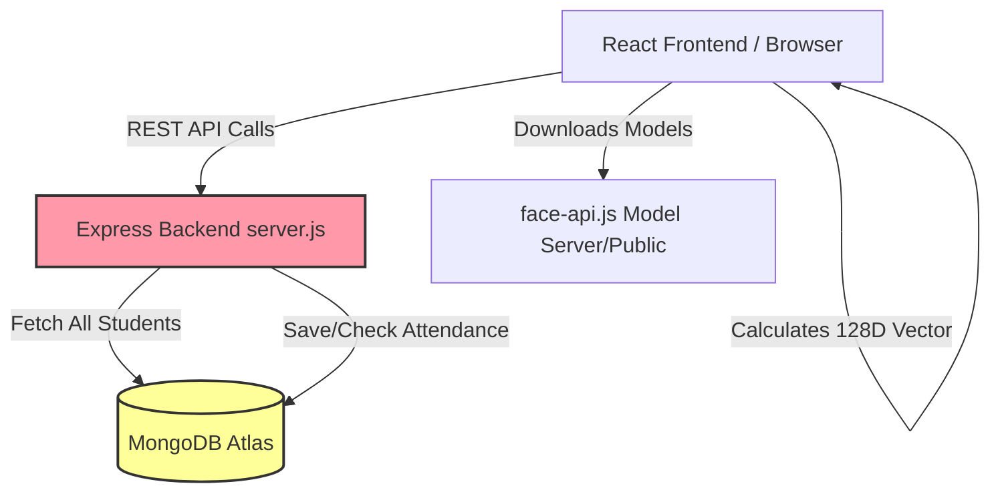
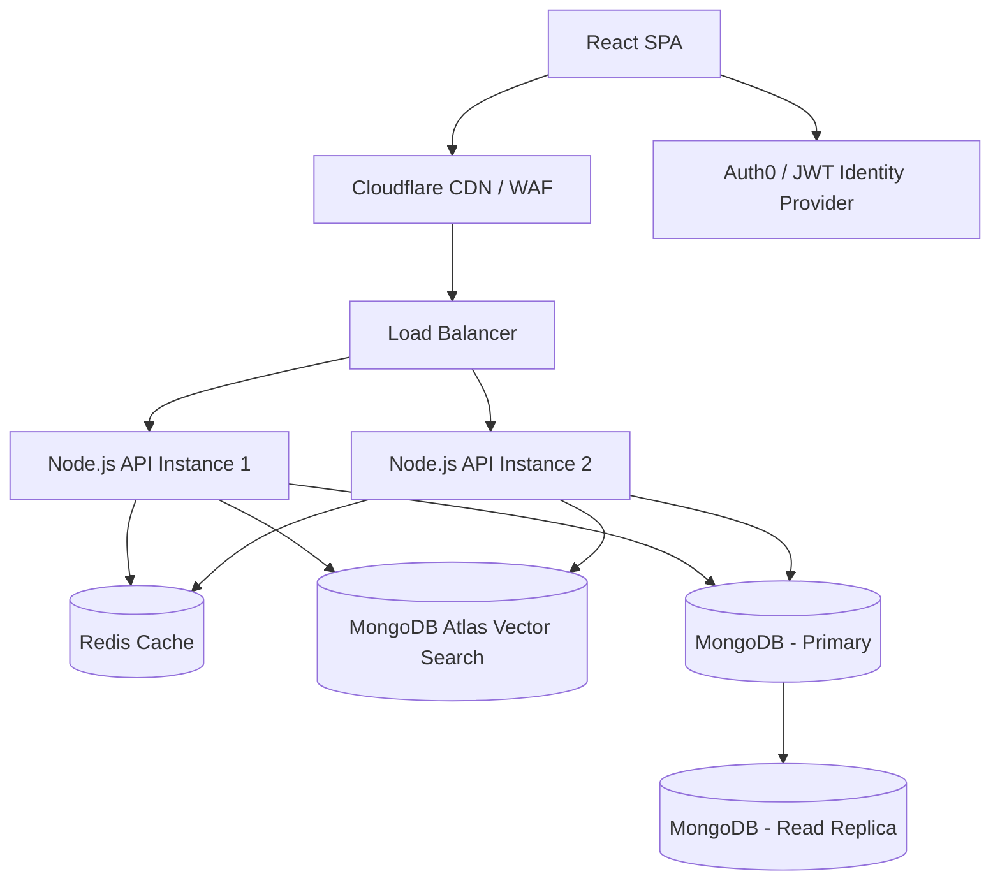

# Face Recognition Attendance System - Enterprise Audit & Roadmap

This document provides a comprehensive production readiness audit, identifies critical bottlenecks, and outlines a multi-phase roadmap to transform the current prototype into an enterprise-grade system.

## 1. Production Readiness Audit

### 🚨 Security Vulnerabilities
- **No Authentication/Authorization:** The API endpoints (`DELETE /api/attendance-history`, `DELETE /api/students/:id`, etc.) are completely unprotected. Anyone who knows the URL can clear the database or delete students.
- **No Liveness Detection (Spoofing):** The current `face-api.js` implementation extracts descriptors from any image. A user can hold up a photo of another student to the webcam to spoof attendance.
- **Lack of Input Validation:** API routes lack robust payload validation (e.g., Zod or Joi), making it susceptible to malformed data or injection attacks.
- **CORS Configuration:** While restricted, relying solely on CORS does not prevent backend abuse via server-to-server or cURL requests.
- **Missing Rate Limiting:** No protection against Brute Force or DDoS attacks on the `/api/mark-attendance` or `/api/register` routes.

### 📉 Scalability Bottlenecks
- **O(N) Linear Search Bottleneck:** `await Student.find({})` fetches *all* students from the database into Node.js memory on *every single attendance request*, followed by a synchronous O(N) Euclidean distance calculation. This will crash the Node.js server under load and high user count.
- **No Caching:** The 30-minute cooldown check hits the database every time. 
- **Unpaginated Data Queries:** `GET /api/students` and `GET /api/attendance-history` fetch the entire collection at once, which will lead to high latency and memory exhaustion as data grows.

### 🗄 Database Design Issues
- **Missing Indexes:** `roll_no` and `timestamp` fields need proper indexing to optimize queries.
- **Inefficient Vector Storage:** Storing a 128-D float array in standard MongoDB documents and processing it in Node is highly inefficient. 

### 🌐 API Architecture Problems
- **Monolithic Route Handlers:** `server.js` contains all route definitions and business logic. It violates the separation of concerns (MVC pattern).
- **Missing Error Handling Middleware:** Errors are caught locally with basic `res.status(500)` calls rather than a centralized error-handling pipeline.

### ⚡ Frontend Performance Issues
- **Heavy Client-Side Processing:** Running ML models on the client device (especially low-end mobile devices) can cause UI freezing and high battery drain.
- **Bundle Size:** `face-api.js` and its models are large. They need to be lazily loaded or cached efficiently via Service Workers.

### 🏗 Deployment Weaknesses
- **Single Point of Failure:** No load balancer or horizontal scaling strategy.
- **No CI/CD:** Deployments to Render/Vercel seem manual or basic git-push based without automated testing or linting gates.
- **Missing Observability:** No centralized logging (e.g., Winston, Datadog) or APM setup to track performance or error rates in production.

---

## 2. Architecture Diagrams

### 🔴 Current Architecture Diagram (Mermaid)



### 🟢 Improved Enterprise Architecture Diagram



---

## 3. Recommended Folder Structure

```text
backend/
├── src/
│   ├── config/          # DB, Redis, Environment variables
│   ├── controllers/     # Business logic (e.g., attendanceController.js)
│   ├── middlewares/     # Auth, Error handling, Rate Limiting
│   ├── models/          # Mongoose Schemas
│   ├── routes/          # Express route definitions
│   ├── services/        # Face matching logic, external APIs
│   ├── utils/           # Helper functions, logger
│   └── app.js           # Express app setup
├── tests/               # Unit and Integration tests
├── package.json
└── server.js            # Entry point

frontend/
├── src/
│   ├── assets/          # Images, icons
│   ├── components/      # Reusable UI components (Buttons, Modals)
│   ├── contexts/        # React Context (Auth, Theme)
│   ├── hooks/           # Custom React hooks (useFaceApi)
│   ├── pages/           # View components (Attendance, AdminDashboard)
│   ├── services/        # Axios API clients
│   ├── utils/           # Helper functions
│   └── App.js
├── public/              # Models for face-api.js
└── package.json
```

---

## 4. Database Schema Improvements

**1. MongoDB Atlas Vector Search**
Utilize MongoDB Atlas's native **Vector Search** to find the closest face descriptor directly at the database layer using HNSW algorithms, reducing the Node.js workload to O(1) processing.

**2. Improved Student Schema (`models/Student.js`)**
```javascript
const studentSchema = new mongoose.Schema({
    name: { type: String, required: true, trim: true },
    roll_no: { type: String, required: true, unique: true, index: true },
    face_descriptor: { type: [Number], required: true }, // Index this field for Vector Search
    isActive: { type: Boolean, default: true }
}, { timestamps: true });
```

**3. Improved Attendance Schema (`models/Attendance.js`)**
```javascript
const attendanceSchema = new mongoose.Schema({
    studentId: { type: mongoose.Schema.Types.ObjectId, ref: 'Student', required: true },
    roll_no: { type: String, required: true }, // Denormalized for fast querying
    timestamp: { type: Date, default: Date.now },
    confidenceScore: { type: Number, required: true }, // Store the match distance
    deviceInfo: { type: String } // Useful for auditing
}, { timestamps: true });

// Compound index for fast cooldown queries
attendanceSchema.index({ roll_no: 1, timestamp: -1 });
```

---

## 5. Security & Deployment Checklists

### 🔐 Security Checklist
- [ ] Implement JWT Authentication for Admin Dashboard.
- [ ] Add Role-Based Access Control (RBAC) (Admin vs Student views).
- [ ] Implement `express-rate-limit` to prevent API abuse.
- [ ] Implement Request Validation using `Zod` or `Joi`.
- [ ] Use `helmet` middleware for setting secure HTTP headers.
- [ ] Implement Anti-Spoofing/Liveness detection (e.g., blink detection or challenge-response in frontend).
- [ ] Rotate database credentials and store them in a secure Secret Manager.

### 🚀 Deployment & DevOps Checklist
- [ ] Move away from free-tier Render if expecting scale; use AWS ECS, Google Cloud Run, or Render Pro with scaling rules.
- [ ] Set up **Redis** (e.g., Upstash) for caching 30-minute attendance cooldowns.
- [ ] Enforce HTTPS only (HSTS).
- [ ] Use a CDN (e.g., Cloudflare) for caching the large `face-api.js` model files.
- [ ] Separate `production`, `staging`, and `development` environments.

### 🔄 CI/CD Pipeline Setup (GitHub Actions)
1. **Lint & Test:** Run ESLint, Prettier, and Jest tests on Pull Requests.
2. **Build:** Build React app and verify Node.js dependencies.
3. **Deploy to Staging:** Auto-deploy `main` branch to a staging URL.
4. **Deploy to Production:** Trigger deployment to production on GitHub Release creation.

### 📊 Monitoring & Backup Strategy
- **Monitoring:** Integrate Datadog or New Relic for APM. Use Sentry for frontend and backend error tracking.
- **Logging:** Implement Winston or Pino in Node.js, forwarding logs to AWS CloudWatch or Datadog.
- **Backups:** Enable Automated Daily Snapshots in MongoDB Atlas with Point-in-Time Recovery (PITR) configured.

---

## 6. Execution Roadmap

### Phase 1: Security & Stability (Immediate)
*   **Action:** Implement JWT Auth for the admin dashboard (protect `/api/students` and `/api/attendance-history`).
*   **Action:** Add input validation middleware to `/api/register` and `/api/mark-attendance`.
*   **Action:** Refactor `server.js` into an MVC folder structure for maintainability.
*   **Action:** Add index to `roll_no` and `timestamp` in MongoDB.

### Phase 2: Performance & Scalability (Short Term)
*   **Action:** Migrate the Euclidean distance calculation from Node.js linear scan to **MongoDB Atlas Vector Search ($vectorSearch)**.
*   **Action:** Add Server-side pagination to the History and Students endpoints.
*   **Action:** Implement **Redis Caching** for the 30-minute attendance cooldown rule.

### Phase 3: Reliability & DevOps (Medium Term)
*   **Action:** Setup GitHub Actions CI/CD pipelines.
*   **Action:** Integrate Sentry for error tracking and a structured logging library.
*   **Action:** Dockerize the backend properly for scalable deployment on Cloud Run or AWS ECS.
*   **Action:** Configure Cloudflare to serve the frontend and cache the ML models.

### Phase 4: Enterprise Features (Long Term)
*   **Action:** Implement Liveness Detection on the frontend to prevent photo spoofing.
*   **Action:** Add analytics dashboard for attendance trends.
*   **Action:** Implement WebSockets for real-time attendance updates on the admin screen.
*   **Action:** Support multiple organizations/classes (multi-tenancy architecture).
